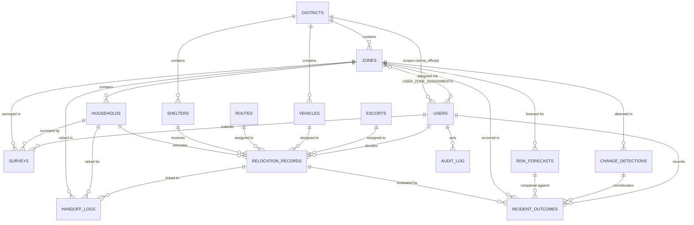

# Backend Schema Document

**RAKSHAK360 — Intelligent Hazard Red-Zone & Relocation Platform**

**Smart India Hackathon 2026 — Problem Statement SIH26191**

| Problem Statement | Intelligent Identification of Hazard-Based Red Zones, Carrying Capacity Assessment, and Immediate Relocation Needs for Vulnerable Habitations |
| --- | --- |
| PS ID | SIH26191 |
| Organization | Ministry of Home Affairs |
| Department | National Disaster Response Force (NDRF), Disaster Management Division |
| Category | Software |
| Theme | Disaster Management |
| Companion documents | PRD v1.1 (what/why); TRD v1.0 (how, system-level) — this document formalizes the entity shapes fixed in TRD §5 into column-level DDL |
| Document Owner | Kasukabe Defense Coders |
| Version | 1.0 |
| Date | September 2026 |

## 1. Purpose and Scope

TRD §5 fixed the shape of eleven core entities so the API contracts in TRD §7 would be stable, and deferred exact column-level DDL to this document. This document delivers that DDL: every table, column, type, constraint, and index needed to stand up the PostgreSQL + PostGIS database for the hackathon build, plus the row-level access design PRD §10 and TRD §10 require for household-level vulnerability data.

Five tables exist here that TRD §5 did not name individually: **districts**, **vehicles**, **escorts**, **user_zone_assignments**, and **incident_outcomes**. TRD §5's `relocation_records` row referenced `vehicle_id` and `escort_id`, and TRD §10 referenced field officers being "scoped by assigned district/zone set" — those references need a table to point at, so `districts`, `vehicles`, `escorts`, and `user_zone_assignments` are added rather than left as dangling foreign keys. `incident_outcomes` is added for a different reason: PRD §7.12 and TRD §8.4 both require ground-truth outcomes to be captured and fed back into the models, and TRD §5's entity table never named where that data lives — it's a gap in the source document, not just a detail deferred to this one, so §5.16 closes it.

Two more deviations from TRD §5's exact wording are worth calling out rather than leaving silently implicit: `households` carries `priority_tier`/`priority_factors` even though TRD §5 lists that field only under `relocation_records` (see §5.4 for why), and `audit_log` splits TRD §5's single `entity_ref` into `entity_type` + `entity_id` (see §5.15 for why). Everything else maps directly onto TRD §5.

This document is scoped to the same MVP as the PRD/TRD: every table here is buildable for the hackathon demo. No table depends on a production-only integration (live Google Flood API, NDMS, Sachet) to exist — those stay API-integration concerns (TRD §6), not schema concerns.

## 2. Conventions

- **Primary keys are UUIDs** (`uuid` type, `gen_random_uuid()` default via the `pgcrypto` extension), not serial integers. This is not a stylistic choice: TRD §9 requires the field-survey app to generate a UUID client-side at capture time so a retried background sync can upsert idempotently instead of creating duplicates. Making every PK a UUID means the same pattern works uniformly — a client can pre-assign an ID before it ever reaches the server — rather than surveys being a special case.
- **Human-readable display codes get their own column, separate from the UUID primary key.** Per CLAUDE.md's ID conventions (`ZN-01` zones, `HH-112` households, `SH-01` shelters, `MV-118` relocation records, `SV-4471` surveys, `HO-221` handoffs, `RT-07` routes), `zones`, `households`, `shelters`, `relocation_records`, `surveys`, `handoff_logs`, and `routes` each carry a `display_code text unique` column (added in migration `0002`, not present in the original v1.0 DDL below until this revision). `zones`/`shelters`/`vehicles` take a caller-supplied code on creation; `surveys`/`households`/`handoff_logs`/`relocation_records`/`routes` get theirs from `next_display_code()`, backed by a real Postgres sequence per prefix (migration `0008`) — **not** by scanning existing rows, which migration `0008`'s own docstring explains was a live, 100%-reproducible bug: that scan ran through the caller's own RLS-scoped session, so a `field_officer`'s restricted view of `surveys`/`households` silently undercounted the true max and collided with a real code in a zone outside their assignment. Found by hand-testing a real survey sync through the deployed field PWA, not by reading the code — see `docs/BUILD-PLAN.md` Phase 9 and `docs/TRD.md` §11 for the full account. **Migration `0009`** exists only because `0008`'s sequences/grants didn't visibly take effect on the live Railway deploy the first time (every sequence-dependent write 500'd there despite the same deploy's unrelated fixes running correctly) — it re-applies `0008`'s exact DDL idempotently rather than guessing at why; see `docs/BUILD-PLAN.md` Phase 9's note on it.
- **Every table** carries `created_at timestamptz not null default now()` and `updated_at timestamptz not null default now()`, the latter maintained by a shared trigger (`set_updated_at()`), except `audit_log`, which is append-only and carries only `created_at`.
- **All geometry columns use PostGIS `geometry` types in SRID 4326** (WGS84 lat/lng), matching Bhuvan/GSI/OSM source data (TRD §8, §4) with no reprojection step needed at ingestion.
- **Enumerated states use native Postgres `ENUM` types**, not free-text columns with a check constraint maintained elsewhere — this keeps invalid states (e.g., a relocation record with a typo'd status) impossible at the database level rather than caught later in application code.
- **Explainability fields are `jsonb`, not a foreign key to a separate "factors" table.** TRD Principle 3 requires every score/priority/ranking to return a `factors[]` array of `{name, weight, input_value, contribution}` alongside the number. Modeling this relationally would mean a join on every dashboard read for no query benefit — factors are always read as a unit with their parent score, never queried independently. §6 below gives the exact shape.
- **Schema name:** all tables live in the default `public` schema for the hackathon build; no multi-tenancy schema-per-district split is needed at pilot scale (one district, Dima Hasao).
- **Migrations:** managed with Alembic (ships with FastAPI/SQLAlchemy tooling already in the stack — TRD §4) rather than hand-run SQL, so the multi-router team isn't drifting on schema state during the hackathon build.

```sql
create extension if not exists postgis;
create extension if not exists pgcrypto;
 
create or replace function set_updated_at()
returns trigger as $$
begin
  new.updated_at = now();
  return new;
end;
$$ language plpgsql;
```

## 3. Enumerated Types

```sql
create type user_role as enum (
  'sdma_official', 'field_officer', 'control_room'
);
 
create type hazard_type as enum (
  'flood', 'landslide', 'cloudburst', 'coastal_erosion'
);
 
create type data_confidence as enum (
  'baseline', 'field_verified', 'due_for_reverification'
);
 
create type structural_condition as enum (
  'Kutcha', 'Semi-pucca', 'Pucca', 'unknown'
);
 
create type priority_tier as enum (
  'immediate', 'short_term', 'medium_term'
);
 
create type shelter_status as enum (
  'active', 'standby', 'full', 'closed', 'damaged'
);
 
create type review_status as enum (
  'unreviewed', 'approved', 'flagged'
);
 
create type relocation_status as enum (
  'assigned', 'in_transit', 'arrived'
);
 
create type vehicle_status as enum (
  'available', 'assigned', 'in_transit', 'unavailable'
);
 
create type handoff_status as enum (
  'open', 'acknowledged', 'in_progress', 'resolved'
);
```

`data_confidence`, `structural_condition`, `priority_tier`, `shelter_status`, `review_status`, and `relocation_status` map 1:1 onto the enum fields already named in TRD §5. `vehicle_status` and `handoff_status` support the new `vehicles` and `handoff_logs` detail this document adds.

## 4. Entity-Relationship Overview

*Mermaid ER diagram source (renders as a diagram in the linked project document):*



## 5. Table Definitions

### 5.1 `districts`

Not in TRD §5, added because `zones.district_id`, `users.district_id`, and `shelters.district_id` all need somewhere to point, and the PRD/TRD both describe a platform designed to scale past a single pilot district (PRD §6, TRD §11: "if district count grows beyond the pilot").

```sql
create table districts (
  district_id uuid primary key default gen_random_uuid(),
  name text not null unique,
  state text not null,
  geom geometry(MultiPolygon, 4326),
  primary_hazards hazard_type[] not null default '{}',
  created_at timestamptz not null default now(),
  updated_at timestamptz not null default now()
);
 
create index idx_districts_geom on districts using gist (geom);
```

For the hackathon demo this table holds exactly one row: Dima Hasao, Assam, `primary_hazards = {landslide, flood}` (PRD §6's honest caveat that the pilot won't produce live coastal/cyclone data applies here at the data level, not just the pitch level).

### 5.2 `users`

```sql
create table users (
  user_id uuid primary key default gen_random_uuid(),
  full_name text not null,
  email text not null unique,
  phone text,
  password_hash text not null,
  role user_role not null,
  district_id uuid references districts(district_id),
  is_active boolean not null default true,
  last_login_at timestamptz,
  created_at timestamptz not null default now(),
  updated_at timestamptz not null default now()
);
 
create index idx_users_district on users(district_id);
create index idx_users_role on users(role);
```

`district_id` scopes an `sdma_official` or `control_room` user to their authority (TRD §10). A `field_officer`'s working set is *zones*, not a whole district — that's a many-to-many relationship, not a single foreign key, so it lives in `user_zone_assignments` (§5.13) rather than a column here.

### 5.3 `zones`

```sql
create table zones (
  zone_id uuid primary key default gen_random_uuid(),
  display_code text unique,
  district_id uuid not null references districts(district_id),
  name text not null,
  geom geometry(Polygon, 4326) not null,
  hazard_types hazard_type[] not null,
  population integer not null default 0 check (population >= 0),
  incident_history jsonb not null default '[]',
  data_confidence data_confidence not null default 'baseline',
  last_verified_at timestamptz,
  last_verified_by uuid references users(user_id),
  susceptibility_score numeric(5,4) check (susceptibility_score between 0 and 1),
  susceptibility_factors jsonb,
  gsi_classification text,
  gsi_score numeric(5,2),
  risk_score_72h numeric(5,4) check (risk_score_72h between 0 and 1),
  risk_score_factors jsonb,
  risk_score_updated_at timestamptz,
  created_at timestamptz not null default now(),
  updated_at timestamptz not null default now()
);
 
create index idx_zones_geom on zones using gist (geom);
create index idx_zones_district on zones(district_id);
create index idx_zones_confidence on zones(data_confidence);
create index idx_zones_hazard_types on zones using gin (hazard_types);
```

`risk_score_72h` is a denormalized cache of the *latest* forecast — the full history of forecasts lives in `risk_forecasts` (§5.10), one row per generation cycle. Reading the current score for the map view should never require scanning that history table, so the current value is duplicated here and refreshed on each ingestion cycle (TRD §7, Forecasting Service).

`gsi_classification` and `gsi_score` hold GSI Bhusanket's own static susceptibility category and index for the zone, kept distinct from `susceptibility_score`/`susceptibility_factors` (the platform's own ML output). TRD §8.1 requires the ML score to be stored *alongside* GSI's classification, not in place of it, so the map's zone detail can show a named "ML-vs-GSI divergence note" (`docs/DESIGN-SYSTEM.md` §5) when the two disagree. These columns are dataset-sourced (loaded once and periodically refreshed from the GSI portal/report, TRD §6), not computed, so they carry no `_factors` companion.

### 5.4 `households`

```sql
create table households (
  household_id uuid primary key default gen_random_uuid(),
  display_code text unique,
  zone_id uuid not null references zones(zone_id),
  geom geometry(Point, 4326) not null,
  population_count integer not null default 0 check (population_count >= 0),
  children_count integer not null default 0 check (children_count >= 0),
  elderly_count integer not null default 0 check (elderly_count >= 0),
  assistance_needs_count integer not null default 0 check (assistance_needs_count >= 0),
  structural_condition structural_condition not null default 'unknown',
  vulnerability_score numeric(5,4) check (vulnerability_score between 0 and 1),
  vulnerability_factors jsonb,
  priority_tier priority_tier,
  priority_factors jsonb,
  data_confidence data_confidence not null default 'baseline',
  last_surveyed_at timestamptz,
  created_at timestamptz not null default now(),
  updated_at timestamptz not null default now()
);
 
create index idx_households_geom on households using gist (geom);
create index idx_households_zone on households(zone_id);
create index idx_households_priority on households(priority_tier);
create index idx_households_confidence on households(data_confidence);
```

`children_count`, `elderly_count`, and `assistance_needs_count` are **not** constrained to sum to `population_count` — a person can be both elderly and assistance-needing, so the categories legitimately overlap (PRD §5's "not just a population count" breakdown is additive information, not a partition).

`data_confidence` reuses the same three-value enum already defined for `zones` (§5.3) rather than a separate household-only type — a zone can be `field_verified` overall while individual households inside it haven't each been checked, so household-level and zone-level confidence are tracked independently but on the same scale. `last_surveyed_at` is the timestamp this state is computed from (the 90-day `due_for_reverification` threshold, `docs/DESIGN-SYSTEM.md` §4). This satisfies CLAUDE.md rule 3 — households, like zones, must carry their verification state and last-verified timestamp in every response that returns them.

**Deviation from TRD §5:** TRD §5's table lists `priority_tier` only as a field of `relocation_records`, not `households`. It's carried here too because PRD §7.3 computes the tier as a live property of a household/zone cluster — it exists and changes before any relocation decision has been made, driving the survey queue (TRD §7.10) and the dashboard's priority view independent of allocation. The value on `relocation_records` (§5.10) is a separate, frozen snapshot taken at the moment an allocation was decided, since the live value here can keep changing afterward and the decision record must stay defensible against what was actually known at the time (PRD §5).

**A real seed-data simplification worth stating plainly:** `backend/app/seed.py` gives every household in a zone the *same* `geom` value — the zone's own centroid (`ZONE_CENTROIDS[zone_code]`), not an individually surveyed point. The column itself is a real per-household `Point`, and the schema/API treat it as such; it's specifically the 11 seeded rows that don't yet carry distinct coordinates. This has a concrete downstream effect on §7.5's shelter-matching: `services/shelter_matching.py` computes `distance_km` from real PostGIS `ST_DistanceSphere` between household and shelter geometry, so two households in the same zone always get an identical distance (and therefore an identical `match_score`) to a given shelter, not a household-specific figure — the matching *math* is real, but at the seeded data's current granularity it effectively operates zone-by-zone, not household-by-household. (This also means `backend/tests/test_scoring.py`'s `test_shelter_match_hh112_sh01` — which pins `distance_km=4.2`/`duration_minutes=18` as "SH-01's demo route figures" — is testing the pure `match_score` function correctly for those inputs, but those specific numbers are the *prototype's* static mock figures, not what the live `GET /households/{id}/shelter-matches` endpoint actually returns for that pair today: the real PostGIS distance between HH-112's seeded point and SH-01 is ≈1.1 km, giving a live match score of ≈0.95, not 0.90.)

### 5.5 `shelters`

```sql
create table shelters (
  shelter_id uuid primary key default gen_random_uuid(),
  display_code text unique,
  district_id uuid not null references districts(district_id),
  name text not null,
  geom geometry(Point, 4326) not null,
  max_capacity integer not null check (max_capacity > 0),
  current_occupancy integer not null default 0 check (current_occupancy >= 0),
  facilities jsonb not null default '{}',
  status shelter_status not null default 'active',
  contact_name text,
  contact_phone text,
  needs jsonb not null default '[]',
  last_updated_at timestamptz,
  created_at timestamptz not null default now(),
  updated_at timestamptz not null default now(),
  constraint chk_occupancy_within_capacity check (current_occupancy <= max_capacity)
);
 
create index idx_shelters_geom on shelters using gist (geom);
create index idx_shelters_status on shelters(status);
```

The capacity check is enforced at the database level, not just the Shelter & Allocation Engine — a shelter cannot be over-allocated even by a bug or a race between two concurrent relocation writes (TRD §7.4/§7.5).

**Migration 0004** added `contact_name`/`contact_phone` (a reachable person for the shelter, surfaced by the Shelter Registration & Management dashboard) and `needs` — a free-form jsonb array of urgent-need tags (`["medical", "food", "water", "blankets", ...]`) a field officer or SDMA official can update independent of `facilities`, which describes what the shelter has, not what it currently lacks. `shelter_status` also gained a 5th value, `standby`: a shelter that is stood up and ready but not currently housing anyone, distinct from `active` (occupied/operating), `full`, `closed`, and `damaged`. This matches a state the prototype's own copy referenced ("SH-05 moved from standby to active roster") but never wired into its seed shelter's `status` field — SH-05 (Tea Estate Godown, 0/300 occupied) is seeded as `standby` here.

### 5.6 `surveys`

```sql
create table surveys (
  survey_id uuid primary key,
  display_code text unique,
  zone_id uuid not null references zones(zone_id),
  household_id uuid references households(household_id),
  officer_id uuid not null references users(user_id),
  submitted_at timestamptz not null,
  synced_at timestamptz,
  payload jsonb not null,
  photo_url text,
  geotag geometry(Point, 4326),
  review_status review_status not null default 'unreviewed',
  reviewed_by uuid references users(user_id),
  reviewed_at timestamptz,
  created_at timestamptz not null default now(),
  updated_at timestamptz not null default now()
);
 
create index idx_surveys_zone on surveys(zone_id);
create index idx_surveys_household on surveys(household_id);
create index idx_surveys_review_status on surveys(review_status);
create index idx_surveys_geotag on surveys using gist (geotag);
```

Note that `survey_id` has **no server-side default**. This is deliberate: the field PWA generates it client-side at capture time (Dexie.js/IndexedDB, TRD §4/§9) before connectivity exists, and the sync endpoint does `insert ... on conflict (survey_id) do update ...`. A retried background-sync after a partial network failure re-sends the same `survey_id` and lands as a no-op update rather than a duplicate row — this is the concrete mechanism behind TRD §9's "server upserts by that UUID rather than inserting blindly."

`household_id` is nullable because a survey can be the *first* contact with a location — the officer may be surveying an unverified zone before any household record exists yet (TRD §7.10's "new/unverified zones first"). A null `household_id` with a non-null `zone_id` means "this survey seeds new household records," resolved by the Survey Service, not the schema.

### 5.7 `vehicles`

Not in TRD §5's table, added because `relocation_records.vehicle_id` (TRD §5) needs a referent, and PRD §7.6 requires "assigns vehicles/transport capacity... to each household or cluster being relocated."

```sql
create table vehicles (
  vehicle_id uuid primary key default gen_random_uuid(),
  district_id uuid not null references districts(district_id),
  display_code text unique,
  route_label text,
  vehicle_type text not null,
  capacity integer not null check (capacity > 0),
  status vehicle_status not null default 'available',
  current_location geometry(Point, 4326),
  created_at timestamptz not null default now(),
  updated_at timestamptz not null default now()
);
 
create index idx_vehicles_district on vehicles(district_id);
create index idx_vehicles_status on vehicles(status);
```

`display_code` (e.g. `BUS-01`) joins the display-code convention §2 already uses for zones/households/shelters/relocation_records/surveys/handoff_logs/routes — added in migration 0005 once the Logistics Tracker started grouping several `relocation_records` onto one vehicle and needed something human-readable to label the card. `route_label` (e.g. `"Ridge Route"`) names the run, not the vehicle class (`vehicle_type` already carries Bus/Truck) — nullable, since an ad hoc truck run isn't necessarily a named route. A vehicle's capacity is no longer "one relocation_record at a time": `relocation_records.vehicle_id` can point to several records concurrently (several households riding the same bus), constrained at the application layer to `sum(population_count) over non-arrived records for that vehicle <= capacity`, not by a DB constraint — see `services/relocations.py`.

### 5.8 `escorts`

Also not in TRD §5, for the same reason as `vehicles` — PRD §7.6 requires "escort personnel" assigned per relocation. Escorts are modeled as their own roster rather than reusing `users`, because an escort (e.g., an NDRF ground-team member) does not necessarily need a platform login — `user_id` is an optional link for the case where they do.

```sql
create table escorts (
  escort_id uuid primary key default gen_random_uuid(),
  user_id uuid references users(user_id),
  full_name text not null,
  agency text,
  contact_phone text,
  status text not null default 'available',
  created_at timestamptz not null default now(),
  updated_at timestamptz not null default now()
);
 
create index idx_escorts_status on escorts(status);
```

### 5.9 `routes`

```sql
create table routes (
  route_id uuid primary key default gen_random_uuid(),
  display_code text unique,
  zone_id uuid not null references zones(zone_id),
  shelter_id uuid not null references shelters(shelter_id),
  origin_geom geometry(Point, 4326) not null,
  dest_geom geometry(Point, 4326) not null,
  path geometry(LineString, 4326) not null,
  blocked_segments jsonb not null default '[]',
  distance_km numeric(8,2),
  estimated_duration_minutes integer,
  created_at timestamptz not null default now(),
  updated_at timestamptz not null default now()
);
 
create index idx_routes_path on routes using gist (path);
create index idx_routes_zone on routes(zone_id);
create index idx_routes_shelter on routes(shelter_id);
```

`path` is the OSRM-computed geometry (TRD §4); `blocked_segments` is what the Routing Service's "blocked segment penalty layer" (TRD §7.7) actually persists — see §6.4 for its shape. `zone_id` (migration `0012`) is which zone this is the evacuation route *for* — added after "Evacuation routes" grew from a single demoed route (`RT-07`, real OSM geometry) into one route per zone; `app/seed.py` computes ZN-02/03/04's routes the same honest straight-line-to-nearest-shelter way `services/shelter_matching.py` already handles "no OSRM instance" for households. `shelter_id` (migration `0013`) is which shelter the route actually leads to — added because `dest_geom` alone was never a reliable way to identify the destination shelter (RT-07's `dest_geom` is wherever its real fetched OSM segment happens to end, not literally `SH-01`'s own point), so the frontend had no way to show which shelter a route serves.

### 5.10 `relocation_records`

```sql
create table relocation_records (
  record_id uuid primary key default gen_random_uuid(),
  display_code text unique,
  household_id uuid not null references households(household_id),
  shelter_id uuid not null references shelters(shelter_id),
  route_id uuid references routes(route_id),
  vehicle_id uuid references vehicles(vehicle_id),
  escort_id uuid references escorts(escort_id),
  priority_tier priority_tier not null,
  priority_factors jsonb,
  allocation_factors jsonb,
  status relocation_status not null default 'assigned',
  decided_by uuid not null references users(user_id),
  assigned_at timestamptz not null default now(),
  in_transit_at timestamptz,
  arrived_at timestamptz,
  created_at timestamptz not null default now(),
  updated_at timestamptz not null default now(),
  constraint chk_status_timestamps check (
    (status = 'assigned') or
    (status = 'in_transit' and in_transit_at is not null) or
    (status = 'arrived' and in_transit_at is not null and arrived_at is not null)
  )
);
 
create index idx_relocation_household on relocation_records(household_id);
create index idx_relocation_shelter on relocation_records(shelter_id);
create index idx_relocation_status on relocation_records(status);
```

`priority_factors` and `allocation_factors` are two separate `jsonb` columns, not one, because they answer two different questions an authority can be asked to defend (PRD §5): *why was this household prioritized* (hazard risk + vulnerability, TRD §7.3) versus *why was this specific shelter chosen for them* (urgency + capacity + distance + facility match + route accessibility, TRD §7.5). Collapsing them into one blob would make it harder to render each explanation where the dashboard actually needs it (priority badge vs. allocation card).

The `chk_status_timestamps` constraint enforces the state machine's forward-only shape from TRD §7.6 (assigned → in_transit → arrived) at the database level — a record can't be marked `arrived` without ever having been `in_transit`.

### 5.11 `risk_forecasts`

```sql
create table risk_forecasts (
  forecast_id uuid primary key default gen_random_uuid(),
  zone_id uuid not null references zones(zone_id),
  horizon_hours integer not null default 72,
  score numeric(5,4) not null check (score between 0 and 1),
  factors jsonb not null,
  model_version text not null,
  generated_at timestamptz not null default now()
);
 
create index idx_risk_forecasts_zone_time on risk_forecasts(zone_id, generated_at desc);
```

One row per forecasting cycle, kept forever rather than overwritten — this is what makes PRD §7.12's post-incident feedback loop possible: comparing what the model predicted at each point against what actually happened requires the full history, not just the latest score (which lives denormalized on `zones.risk_score_72h`, §5.3).

### 5.12 `change_detections`

```sql
create table change_detections (
  detection_id uuid primary key default gen_random_uuid(),
  zone_id uuid not null references zones(zone_id),
  before_image_ref text not null,
  after_image_ref text not null,
  affected_area_geom geometry(MultiPolygon, 4326),
  confidence numeric(5,4) check (confidence between 0 and 1),
  cross_referenced_survey_ids uuid[] not null default '{}',
  cross_referenced_household_ids uuid[] not null default '{}',
  detected_at timestamptz not null default now(),
  created_at timestamptz not null default now()
);
 
create index idx_change_detections_zone on change_detections(zone_id);
create index idx_change_detections_geom on change_detections using gist (affected_area_geom);
```

`before_image_ref`/`after_image_ref` are descriptive labels (`zones/{code}/before.png` style), not literal object-storage keys as originally designed — **see §5.16a below: the one curated pair this platform actually runs against lives in Postgres, not MinIO/S3, because no MinIO instance exists on the live deployment.** A real, non-demo `before_image_ref` (production scope, TRD §4) would still be an object-storage key; `change_detections` itself doesn't change to accommodate that, only where the *demo* pair's bytes are read from does. `cross_referenced_survey_ids`/`cross_referenced_household_ids` are plain UUID arrays rather than a join table, because this is a one-time computed result written once per detection run, not a relationship that grows or needs its own queries.

### 5.12a `sample_imagery`

```sql
create table sample_imagery (
  zone_display_code text not null,
  kind text not null check (kind in ('before', 'after')),
  content_type text not null,
  data bytea not null,
  created_at timestamptz not null default now(),
  primary key (zone_display_code, kind)
);
```

Added in migration `0010`, not part of the original v1.0 design — a genuine deployment-driven schema change, not a stylistic one. `POST /zones/{id}/change-detections/run` (§7.11) needs a real before/after pair to run its real differencing pipeline against; the pair itself is a curated, hackathon-labeled synthetic image (`app/cv/change_detection.py`'s module docstring — a NumPy-generated texture standing in for a satellite pass, not a real Sentinel capture), which was originally meant to live in MinIO (TRD §4's object-storage design) but couldn't, because no MinIO instance is provisioned on the live Railway deployment (`docs/TRD.md` §11) — `object_exists()` against an unreachable host returns `False` indistinguishably from "never uploaded," which read live as "no curated before/after imagery uploaded for zone 'ZN-01' yet" even immediately after a fresh seed or reset. Two small (~200x200, grayscale) PNGs per zone is well within reason to store as `bytea` directly rather than stand up object storage for; this table exists specifically for that one curated demo asset, not as a general-purpose MinIO replacement — no RLS (not household-linked data, same reasoning as `handoff_logs`, §7), and `app_user` has a direct `select, insert, update, delete` grant (migration `0010`) since it's fully reseedable, unlike the append-only `audit_log`.

### 5.13 `user_zone_assignments`

Not in TRD §5, added to give field-officer zone scoping (TRD §10: "scoped by... assigned district/zone set") a concrete home, since it is a many-to-many relationship (one officer can cover several zones; a zone can have more than one officer assigned over time) that doesn't fit as a column on `users` or `zones`.

```sql
create table user_zone_assignments (
  user_id uuid not null references users(user_id),
  zone_id uuid not null references zones(zone_id),
  assigned_at timestamptz not null default now(),
  primary key (user_id, zone_id)
);
 
create index idx_zone_assignments_zone on user_zone_assignments(zone_id);
```

### 5.14 `handoff_logs`

```sql
create table handoff_logs (
  log_id uuid primary key default gen_random_uuid(),
  display_code text unique,
  need_type text not null,
  agency text not null,
  status handoff_status not null default 'open',
  linked_record_id uuid references relocation_records(record_id),
  zone_id uuid references zones(zone_id),
  household_id uuid references households(household_id),
  description text,
  raised_at timestamptz not null default now(),
  acknowledged_at timestamptz,
  resolved_at timestamptz,
  created_at timestamptz not null default now(),
  updated_at timestamptz not null default now(),
  constraint chk_handoff_has_context check (
    linked_record_id is not null or zone_id is not null or household_id is not null
  )
);
 
create index idx_handoff_status on handoff_logs(status);
create index idx_handoff_linked_record on handoff_logs(linked_record_id);
```

`linked_record_id` alone (TRD §5's original naming) is not always available: PRD §7.13 says medical/rescue needs surfaced on the dashboard are routable "as a recorded handoff," and a need can be raised against a zone or household directly, before any relocation record exists for it. The `chk_handoff_has_context` constraint just guarantees every handoff points at *something* concrete an agency can act on.

### 5.15 `audit_log`

```sql
create table audit_log (
  entry_id uuid primary key default gen_random_uuid(),
  actor_id uuid not null references users(user_id),
  action_type text not null,
  entity_type text not null,
  entity_id uuid not null,
  factors_snapshot jsonb,
  created_at timestamptz not null default now()
);
 
create index idx_audit_entity on audit_log(entity_type, entity_id);
create index idx_audit_actor on audit_log(actor_id);
 
revoke update, delete on audit_log from public;
```

This table has no `updated_at` and no application role is ever granted `update`/`delete` on it — it is append-only by construction, not just by convention, because PRD §10 requires relocation decisions and priority rankings to be "logged for post-incident review and accountability," which only holds if the log itself can't be quietly edited.

**Deviation from TRD §5:** TRD §5 names this field `entity_ref` as a single reference. It's split here into `entity_type` + `entity_id` because a bare UUID by itself doesn't say which table it points to — `audit_log` covers writes across `zones`, `households`, `relocation_records`, and more, so the type discriminator is required for the reference to resolve to anything, not an optional refinement.

### 5.16 `incident_outcomes`

Not in TRD §5 — and not fixable by mapping it onto an existing table, because it's a gap in TRD §5 itself. PRD §7.12 and TRD §8.4 both require ground-truth outcomes ("whether the assigned shelter was adequate, whether the route held up," what actually happened) to be captured post-incident and fed back to correct the risk and allocation models. Without a table, that requirement has nowhere to land.

```sql
create table incident_outcomes (
  outcome_id uuid primary key default gen_random_uuid(),
  zone_id uuid not null references zones(zone_id),
  relocation_record_id uuid references relocation_records(record_id),
  forecast_id uuid references risk_forecasts(forecast_id),
  detection_id uuid references change_detections(detection_id),
  occurred_at timestamptz not null,
  shelter_adequate boolean,
  route_held_up boolean,
  actual_impact jsonb,
  notes text,
  recorded_by uuid not null references users(user_id),
  recorded_at timestamptz not null default now(),
  created_at timestamptz not null default now()
);
 
create index idx_incident_outcomes_zone on incident_outcomes(zone_id);
create index idx_incident_outcomes_forecast on incident_outcomes(forecast_id);
create index idx_incident_outcomes_record on incident_outcomes(relocation_record_id);
```

`forecast_id` is what makes the feedback loop actually closeable: joining `incident_outcomes.occurred_at`/`actual_impact` against `risk_forecasts.score`/`factors` for the same zone and time window is exactly "comparing what the model predicted against what actually happened" (TRD §8.4), which is what the periodic retraining job (also TRD §8.4) reads from. `shelter_adequate` and `route_held_up` are plain booleans, not derived — PRD §7.12 names them as the two specific post-incident questions an authority answers directly, not scores the system computes. `relocation_record_id` and `detection_id` are both nullable because an outcome can exist for a zone-level forecast that never produced a relocation, or without a satellite pass to corroborate it — `zone_id` is the one required anchor every outcome must have.

## 6. JSONB Field Shapes

TRD Principle 3 makes explainability a data guarantee, not a UI-layer promise. The following shapes are the concrete contract every service must write to and the dashboard reads from.

### 6.1 `factors` (used by `zones.susceptibility_factors`, `zones.risk_score_factors`, `households.vulnerability_factors`, `households.priority_factors`, `relocation_records.priority_factors`, `relocation_records.allocation_factors`, `risk_forecasts.factors`)

```json
[
  {
    "name": "rainfall_72h_mm",
    "weight": 0.35,
    "input_value": 142.5,
    "contribution": 0.31
  },
  {
    "name": "slope_degrees",
    "weight": 0.25,
    "input_value": 34.2,
    "contribution": 0.22
  }
]
```

Every scoring service (TRD §7) writes this exact array shape regardless of which score it's attached to — the dashboard renders one generic "explain this score" component against any of the six columns above, rather than one bespoke renderer per score type.

### 6.2 `zones.incident_history`

```json
[
  {
    "hazard_type": "landslide",
    "date": "2022-05-14",
    "severity": "high",
    "source": "GSI historical incident report",
    "description": "Cluster landslide event; damaged rail connectivity"
  }
]
```

### 6.3 `shelters.facilities`

```json
{
  "water": true,
  "medical": true,
  "toilets": true,
  "power": true,
  "other": ["generator", "kitchen"]
}
```

`water`/`medical`/`toilets`/`power` are the 4 canonical facility categories the prototype's `matchFactors()` "Facility match" factor counts and divides by (`s.fac.length / 4`, ported in Phase 2 as `facility_count(...) / 4`). This v1.0 shape was missing `power` as its own boolean — the prototype tracked it as a 4th first-class category, not an extra, so it belongs alongside `water`/`medical`/`toilets` rather than inside `other`. `other` stays for genuinely extra amenities beyond those 4 (generators, a kitchen) that don't factor into that ratio.

### 6.4 `routes.blocked_segments`

```json
[
  {
    "osm_way_id": "48213902",
    "reason": "landslide debris",
    "source": "field_report",
    "reported_by": "survey:3f9a...-uuid",
    "reported_at": "2026-09-10T04:12:00Z"
  }
]
```

`source` is either `"field_report"` (from a survey, TRD §7.10) or `"change_detection"` (from §5.12) — matching TRD §7.7's "blocked-road status can be informed by satellite/SAR-based change detection when ground verification isn't possible."

### 6.5 `surveys.payload`

```json
{
  "household_count": 4,
  "children_count": 1,
  "elderly_count": 1,
  "assistance_needs_count": 0,
  "structural_condition": "Semi-pucca",
  "population_count": 6,
  "notes": "Roof damage visible on north side"
}
```

This mirrors the household vulnerability-assessment fields exactly (PRD §7.10: "a structured checklist matching the vulnerability-assessment fields"), so the Survey Service can apply a confirmed submission directly onto a `households` row without a translation step.

## 7. Security & Row-Level Access

PRD §10 and TRD §10 require household-level vulnerability data restricted to authorized roles, and a `field_officer` scoped to their assigned zones. This is enforced with Postgres Row-Level Security rather than left to application code to remember on every query path — a missed `WHERE` clause in one API route would otherwise leak data.

```sql
alter table households enable row level security;
alter table households force row level security;
 
create policy household_access on households
  using (
    current_setting('app.current_role', true) in ('sdma_official', 'control_room')
    or zone_id in (
      select zone_id from user_zone_assignments
      where user_id = current_setting('app.current_user_id', true)::uuid
    )
  );
 
alter table zones enable row level security;
alter table zones force row level security;
 
create policy zone_access on zones
  using (
    current_setting('app.current_role', true) in ('sdma_official', 'control_room')
    or zone_id in (
      select zone_id from user_zone_assignments
      where user_id = current_setting('app.current_user_id', true)::uuid
    )
  );
 
alter table surveys enable row level security;
alter table surveys force row level security;
 
create policy survey_access on surveys
  using (
    current_setting('app.current_role', true) in ('sdma_official', 'control_room')
    or zone_id in (
      select zone_id from user_zone_assignments
      where user_id = current_setting('app.current_user_id', true)::uuid
    )
  );
 
alter table relocation_records enable row level security;
alter table relocation_records force row level security;
 
create policy relocation_access on relocation_records
  using (
    current_setting('app.current_role', true) in ('sdma_official', 'control_room')
    or household_id in (
      select h.household_id
      from households h
      join user_zone_assignments uza on uza.zone_id = h.zone_id
      where uza.user_id = current_setting('app.current_user_id', true)::uuid
    )
  );
```

**A fourth table, added later (migration `0003`), beyond the three originally named above.** `relocation_records` has no `zone_id` column of its own — a relocation ties to a `household_id`, and a household's zone is what determines who's allowed to see it — so its policy joins `household_id -> households.zone_id -> user_zone_assignments` rather than filtering directly, the same shape `survey_access` would need if `surveys` didn't already carry its own `zone_id` column. Phase 6 shipped `POST /relocations` and `PATCH /relocations/{id}/status` gated to `sdma_official` at the API layer, but left `GET /relocations` and `GET /relocations/{id}` unscoped — any authenticated role could read any relocation record, including ones tied to households outside a `field_officer`'s assigned zones. That's the same class of gap rule 7 exists to close at the database layer rather than trust every route to remember a `WHERE` clause: a relocation record reveals which household is being moved where, which is exactly the kind of household-linked fact PRD §10's access restriction is about, not merely an operational logistics detail.

`app.current_role` and `app.current_user_id` are set per-connection by the FastAPI request middleware from the JWT (TRD §10) before any query runs, via `select set_config('app.current_role', ..., false)` — parameterized, not string-interpolated into a `SET LOCAL` statement. The third argument is `false` (session-scoped, not transaction-local) deliberately: Phase 3 found that a transaction-local setting silently resets after the *first* `commit()` in a request, so a handler that commits and then reads back what it just wrote (e.g. create a zone, then re-fetch it to build the response) would lose its role context on the second query and see nothing — RLS hiding a row from the very request that inserted it. Session-scoped is safe here specifically because every RLS-sensitive request sets this unconditionally before its first protected query, so a reused pooled connection never runs a query against households/zones/surveys/relocation_records on context left over from a previous request. The same policy shape applies to `zones` (an officer's map view is naturally scoped to what they're assigned to survey, per TRD §7.10's prioritized survey queue), `surveys` (an officer only sees submissions for their assigned zones), and `relocation_records` (an officer only sees relocation decisions for households in their assigned zones). `sdma_official` and `control_room` bypass the zone filter entirely, matching their "full dashboard access" / "read-only dashboard access during active events" roles (TRD §10).

**`FORCE ROW LEVEL SECURITY` is not optional here, and neither is a dedicated application role.** Postgres table owners — and superusers, unconditionally — bypass RLS policies by default; `FORCE ROW LEVEL SECURITY` closes the owner loophole but still does nothing for a superuser. The Docker Compose `POSTGRES_USER` (`ps191`) is created as a Postgres superuser and owns every table (it runs the Alembic migrations), so if the FastAPI app connected as `ps191`, every policy above would compile and silently do nothing — exactly the undetectable-in-a-demo failure mode rule 7 warns about. Migration `0002` therefore creates a second, non-superuser role, `app_user`, granted only `SELECT`/`INSERT`/`UPDATE` on the schema (`SELECT`/`INSERT` only on `audit_log`, per rule 2) and no `BYPASSRLS` attribute. `ps191` remains the migration/owner connection (`MIGRATION_DATABASE_URL`, used only by Alembic); the running application and the seed script connect as `app_user` (`DATABASE_URL`). Both are set in `docker-compose.yml`/`.env`.

**`app_user` has no blanket `DELETE` — it's been granted one table at a time, on demand, as `services/demo_seed.py`'s "Reset demo data" grew to touch more of the schema.** Nothing in the app deleted rows at all until that judge-facing reset action needed to tear down `relocation_records`/`surveys` and their dependents (`handoff_logs`, `incident_outcomes`, both FK'd to `relocation_records` with no `ON DELETE` clause, so they have to go first) before reseeding, so those four tables got a scoped `DELETE` grant (migration `0006`) rather than widening the migration `0002` grant to every table. Migration `0007` added a fifth, `risk_forecasts`, once the reset grew to also put each zone's 72h risk score back to its seeded baseline — the "Generate" forecast button's per-cycle rainfall jitter means repeated clicks genuinely diverge from that baseline, so resetting it means deleting the generated rows, not just recomputing something. Two more followed the same pattern for the same reason (a real bug found live, not planned ahead of time): migration `0010` grants full `select`/`insert`/`update`/`delete` on the new `sample_imagery` table (§5.12a) since it's fully reseedable demo-only data, and migration `0011` adds `change_detections` as a sixth table under this same narrative — the reset never cleared a zone's previously-run SAR detection, so a judge saw stale results survive straight through a reset until that gap was closed. Seven tables carry a `DELETE` grant today, across four migrations, all following the identical justification: something reseedable that "Reset demo data" needs to actually clear. `audit_log` stays out of reach exactly as before: the demo reset never touches it, and `app_user` still has no `UPDATE`/`DELETE` privilege on it regardless. RLS already covered `DELETE` on `relocation_records`/`surveys` without any policy change, since both policies are declared `FOR ALL` (no `FOR` clause) rather than command-scoped; `risk_forecasts`, `zones`, `sample_imagery`, and `change_detections` carry no RLS policy of their own to begin with (`zones` has a `SELECT`-shaped policy only — see its own entry above), so the grant alone is what each reset needed.

## 8. Indexing Summary

| Index type | Where | Why |
| --- | --- | --- |
| GiST (spatial) | Every geometry column: zones.geom, households.geom, shelters.geom, routes.path, change_detections.affected_area_geom, surveys.geotag, districts.geom, vehicles.current_location | Point-in-polygon zone lookup, nearest-shelter distance queries, and route geometry checks are core to nearly every functional requirement (TRD §5) — none of these are edge-case queries |
| GIN | zones.hazard_types | Filtering the map by hazard type is a direct dashboard filter, not a full scan candidate |
| B-tree (FK/status) | zone_id, household_id, shelter_id, district_id on every child table (including incident_outcomes.zone_id/forecast_id/relocation_record_id); status/review_status/data_confidence enum columns | Every dashboard list view filters by one of these |
| Composite | risk_forecasts(zone_id, generated_at desc) | "Latest forecast per zone" is the dashboard's actual access pattern, not "all forecasts ever" |

## 9. What This Document Does Not Cover

- **Read-optimized aggregation.** TRD §7.8's `/dashboard/summary` endpoint composes zones, households, shelters, routes, and handoffs into one payload — that's a query/service concern over the tables above, not a separate materialized table, unless load testing during the hackathon build shows the composed query is too slow for the low-bandwidth requirement (TRD §9), in which case a materialized view is the first fix to reach for, not a schema redesign.
- **Delta-sync bookkeeping.** The `since` timestamp parameter (TRD §9) reads directly off each table's `updated_at` — no separate change-log table is needed for this at pilot scale.
- **ML training data storage.** Feature tables for the susceptibility/forecasting models (TRD §8.1/§8.2 — terrain slope, land-use change, historical rainfall) are raster/tabular training inputs prepared with GDAL/rasterio outside the transactional database, not application tables; only the resulting `susceptibility_score`/`risk_score_72h` and their `factors` land here.

## 10. Related Documents

- **Product Requirements Document (`docs/PRD.md`)** — v1.1, defines the *what* and *why*.
- **Technical Requirements Document (`docs/TRD.md`)** — v1.0, defines system architecture and fixes the entity-level shape this document formalizes (TRD §5).
- **Design System (`docs/DESIGN-SYSTEM.md`)** — dashboard layouts, survey-app flow, colour tokens, screen inventory.
- **Build Plan (`docs/BUILD-PLAN.md`)** — the conflict-resolution record behind this document's resolved enums and column additions.
