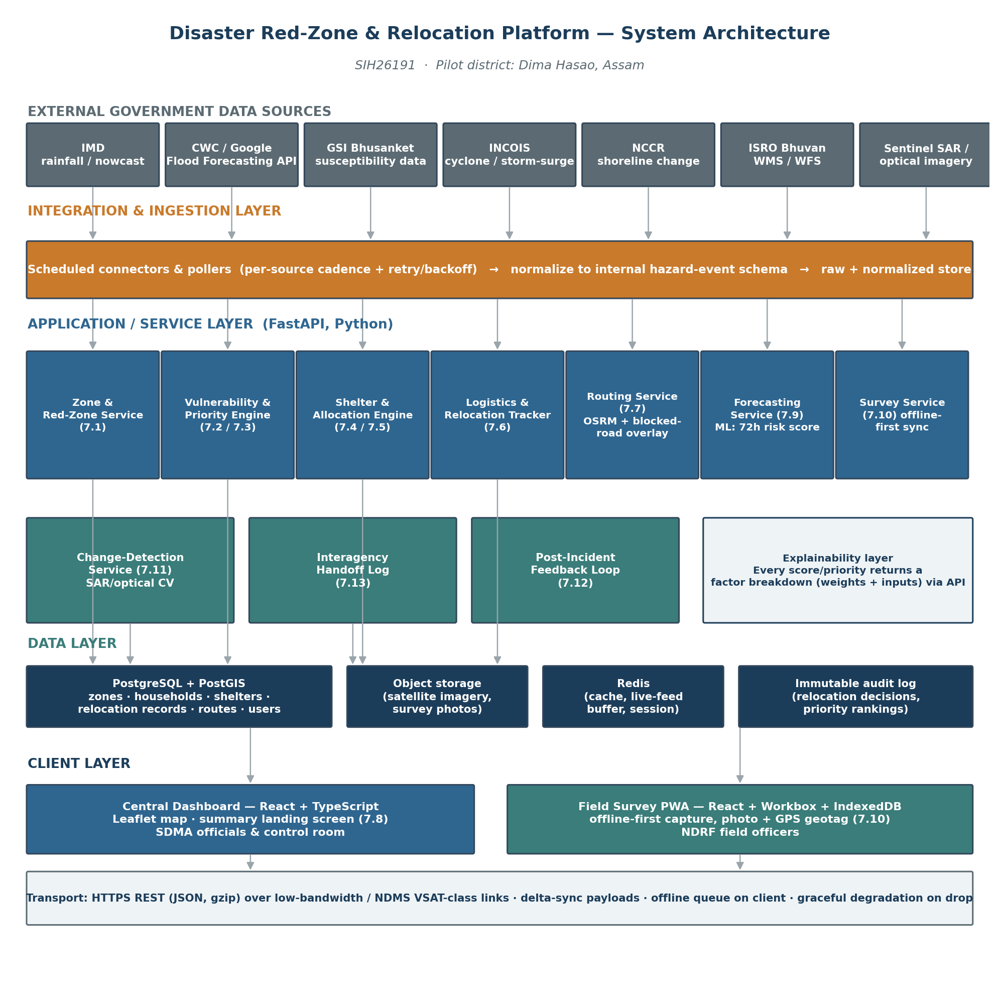
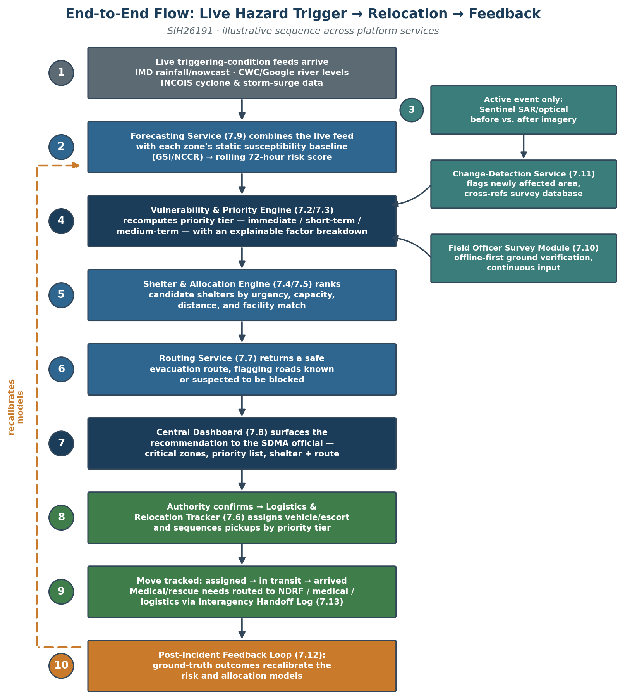

# Technical Requirements Document

**Intelligent Hazard Red-Zone & Relocation Platform**

*Smart India Hackathon 2026 — Problem Statement SIH26191*

| Problem Statement | Intelligent Identification of Hazard-Based Red Zones, Carrying Capacity Assessment, and Immediate Relocation Needs for Vulnerable Habitations |
| --- | --- |
| PS ID | SIH26191 |
| Organization | Ministry of Home Affairs |
| Department | National Disaster Response Force (NDRF), Disaster Management Division |
| Category | Software |
| Theme | Disaster Management |
| Companion document | Product Requirements Document (PRD), v1.1 — defines what and why; this document defines how |
| Document Owner | Kasukabe Defense Coders |
| Version | 1.0 |
| Date | September 2026 |

## Table of Contents

1. Purpose and Scope

2. Guiding Technical Principles

3. System Architecture

4. Technology Stack

5. Database & Data Model

6. External API Integration

7. Functional Requirement → Technical Component Mapping

8. AI/ML Components — Detail

9. Offline-First & Low-Bandwidth Design

10. Security, Access Control & Data Privacy

11. Deployment Architecture

12. MVP Technical Scope vs. Full Vision

13. Assumptions, Constraints & Risks (Technical)

14. Resolved Technical Decisions

15. Related Documents

## 1. Purpose and Scope

This TRD translates the approved PRD (v1.1) into a concrete, buildable technical design: system architecture, technology stack, data model, external API integration approach, the three genuine ML/AI components, and the non-functional mechanisms (explainability, offline-first sync, low-bandwidth operation, auditability) that the PRD requires.

It is scoped to match the PRD's own MVP/full-vision split (PRD §6): every choice below is marked as either built for the hackathon demo or designed for, not built — a component the architecture accommodates and the API contracts anticipate, but that is not live in the pilot build. Nothing here contradicts the PRD; where the PRD leaves an open decision (§13), this document proposes a default and flags it as such.

## 2. Guiding Technical Principles

Four decisions shape every choice in this document:

- One stack, not two. Every genuine ML/AI component in the PRD (satellite change detection, 72-hour forecasting, susceptibility refinement) is Python-native. Rather than splitting the team across a JS backend and a separate Python ML service, the backend itself is Python (FastAPI), so models are called in-process or via a thin internal queue — not a second language boundary the team has to maintain during a hackathon.
- Spatial data is a first-class citizen, not a bolt-on. Zones, households, shelters, and routes are all geometry. The database is PostGIS from day one, not a relational schema with lat/lng columns added later.
- Explainability is an API contract, not a UI afterthought. Per PRD §10, every score/priority/ranking is required to show its factors. This is enforced by having each scoring service return a factors[] array (name, weight, input value, contribution) alongside the number — the dashboard renders whatever the API sends, it doesn't reverse-engineer a black box.
- Design for the connectivity you'll actually have. Per PRD §9, the platform must run over NDMS-class VSAT/low-bandwidth links. Payload size and offline tolerance are architectural constraints checked at every layer, not a “sync feature” added to the field app alone.

## 3. System Architecture

The platform is a five-layer architecture: external data sources, an integration/ingestion layer, an application/service layer, a data layer, and a client layer, connected over a transport layer designed for constrained links (see Figure 1). **This section describes the full target design; §12 states plainly which of these layers actually exist as running code in the current pilot build versus which are architecture the codebase leaves room for.** As of this build, none of the ingestion connectors below are implemented — every external-source value on a zone (`susceptibility_score`, `gsi_classification`, incident history) is research findings encoded once as labeled sample data by `backend/app/seed.py`, and the forecasting model's "live" rainfall input is a jittered placeholder (§8.2), not a network call to any of these sources.

**External government data sources.**

IMD (rainfall/nowcast), CWC/Google Flood Forecasting API, GSI Bhusanket, INCOIS, NCCR, ISRO Bhuvan, and Sentinel SAR/optical imagery — the platform is designed to consume these as-is, per PRD §8, and generates none of this data itself. No connector to any of them is built yet (see the note above); the pilot's zone/incident data was hand-researched from several of these sources (`docs/BUILD-PLAN.md`, Phase 3 findings) and encoded as sample data, which is a one-time research step, not a live integration.

**Integration & ingestion layer.**

A set of scheduled connectors, one per source, each with its own polling cadence, retry/backoff policy, and a normalizer that maps the source's native format into an internal hazard-event schema. Both the raw payload and the normalized event are persisted — raw for audit/debugging, normalized for everything downstream. This isolates the rest of the system from any one source's quirks (GSI/NCCR being portal-based rather than API-based, IMD's unconfirmed rate limits, etc. — PRD §12).

**Application/service layer.**

One FastAPI app, one process, with a router per PRD functional requirement or closely related pair (mapped in full in §7 — 14 routers as of the current build: zones, households, shelters, vehicles, escorts, relocations, routes, dashboard, surveys, forecasts, change_detection, handoffs, incident_outcomes, demo, plus auth). This is the resolved form of decision 1 in §14 below — drawn so a router could later move behind its own service without an API contract change, but nothing is split into separate services today; there is no inter-service REST traffic to speak of.

**Data layer.**

PostgreSQL + PostGIS as the system of record; object storage for imagery and survey photos; Redis for caching and live-feed buffering; an append-only audit log table for relocation decisions and priority rankings (PRD §10, auditability). **As shipped:** PostGIS and the audit log are real and load-bearing. Object storage (MinIO) is genuinely wired, but only for change-detection imagery (`backend/app/storage.py`, used by `backend/app/services/change_detection.py`) — a submitted survey's `photo_url` is stored as a plain string reference from the sync payload; the field PWA's capture form (§9) doesn't currently include a photo/camera field, so nothing is actually uploaded to object storage for surveys yet. Redis is declared in configuration (`backend/app/config.py`) but has no calling code anywhere in the backend — no caching or live-feed buffering is implemented, since there is no live feed yet to buffer (§11's ingestion-layer note above).

**Client layer.**

A React dashboard for SDMA officials/control room, and a separate installable web app (PWA) for field officers, built offline-first.

**Transport.**

HTTPS/REST with JSON payloads, gzip-compressed, designed to degrade gracefully on NDMS-class satellite/VSAT links (PRD §9) rather than assuming always-on broadband.

*Figure 1 — System Architecture*

## 4. Technology Stack

| Layer | Choice | Why |
| --- | --- | --- |
| Central dashboard (frontend) | React 18 + TypeScript, Vite build | Fast hackathon iteration; large ecosystem; TypeScript catches integration bugs across a multi-person team under time pressure |
| Mapping (dashboard) | Leaflet.js + GeoJSON, with direct WMS/WFS layer support | Open-source, no license/API-key friction during a hackathon; consumes Bhuvan's WMS/WFS layers (PRD §8) directly |
| Field survey app | React + Vite, packaged as a PWA (Workbox service worker) | One codebase, installable on field officers' phones without an app-store build; service worker enables offline-first (§9) in the demo timeframe |
| Offline client storage | IndexedDB (via Dexie.js) | Structured local storage for queued survey submissions and cached zone/shelter data, with a defined schema for delta-sync |
| Backend API | Python 3.11 + FastAPI + Uvicorn | Async, auto-generated OpenAPI docs, and the same language as every ML component — see Principle 1 |
| Database | PostgreSQL 15 + PostGIS 3 | Spatial queries (point-in-polygon, distance/nearest-shelter, route geometry) are core to almost every requirement |
| Cache / live-feed buffer | Redis | Caches polled hazard feeds between ingestion cycles; backs the offline-sync queue's server side |
| Object storage | S3-compatible bucket (MinIO for demo; AWS S3 / NIC MeghRaj for hosted deployment) | Satellite imagery tiles and survey photos don't belong in the relational DB |
| Routing engine | OSRM over OpenStreetMap road network for Dima Hasao district | Open, self-hostable, fast; supports a custom blocked-segment penalty layer for §7.7 |
| ML — susceptibility refinement & forecasting | scikit-learn / XGBoost, GDAL + rasterio for terrain derivatives | Matches the published frequency-ratio / weight-of-evidence / random-forest methodology already available for Dima Hasao |
| ML/CV — satellite change detection | PyTorch + rasterio/OpenCV; differencing/thresholding baseline, Siamese U-Net as stretch | Reflects the PRD's honesty about this being demoed conceptually via a before/after pair |
| Auth | OAuth2 password flow + JWT (FastAPI security utilities) | Standard, fast to implement, supports role-based access (PRD §10) |
| Containerization / demo deployment | Docker Compose (frontend, services, Postgres+PostGIS, Redis, MinIO, OSRM) | One-command spin-up for judges/reviewers; mirrors production composition |
| CI | GitHub Actions (lint + test on push) | Keeps a multi-person student team from breaking each other's services during crunch |
| Designed for, not built — production hosting | Government cloud (NIC MeghRaj) or on-prem near an NDMS point of presence | Matches PRD §9's low-bandwidth/VSAT constraint |
| Designed for, not built — production messaging | MQTT or a managed queue (e.g., SQS) for survey-sync and interagency handoff at scale | REST + IndexedDB queueing suffices at hackathon/pilot scale; a queue matters as officer count and event volume grow |

## 5. Database & Data Model

PostGIS is used for every table with a spatial dimension. Below are the core entities; exact column-level DDL belongs in the separate Backend Schema Document (PRD §14), but the shape is fixed here so the API contracts in §7 are stable.

| Entity | Key fields | Notes |
| --- | --- | --- |
| zones | zone_id, geom (POLYGON), hazard_types[], population, incident_history (JSONB), data_confidence, last_verified_at, susceptibility_score, risk_score_72h | One row per red zone; §7.1, §7.9 |
| households | household_id, zone_id (FK), geom (POINT), population_count, children_count, elderly_count, assistance_needs_count, structural_condition, vulnerability_score | §7.2 |
| shelters | shelter_id, geom (POINT), max_capacity, current_occupancy, facilities (JSONB), status | §7.4 |
| surveys | survey_id, zone_id (FK), officer_id (FK), submitted_at, payload (JSONB), photo_url, geotag (POINT), review_status | Offline-captured, synced; §7.10 |
| relocation_records | record_id, household_id (FK), shelter_id (FK), priority_tier, route_id (FK), status, vehicle_id, escort_id, timestamps | §7.5, §7.6 |
| routes | route_id, origin_geom, dest_geom, path (LINESTRING), blocked_segments (JSONB), updated_at | §7.7 |
| risk_forecasts | forecast_id, zone_id (FK), horizon_hours, score, factors (JSONB), generated_at | Rolling 72h score; §7.9 |
| change_detections | detection_id, zone_id (FK), before_image_ref, after_image_ref, detected_at, affected_area_geom, cross_referenced_survey_ids[] | §7.11 |
| handoff_logs | log_id, need_type, agency, status, linked_record_id, timestamps | §7.13 |
| audit_log | entry_id, actor_id, action_type, entity_ref, factors_snapshot (JSONB), created_at | Immutable, append-only; PRD §10 |
| users | user_id, role, district_id, auth fields | RBAC per PRD §10 |

Every scoring/ranking table (zones.susceptibility_score, households.vulnerability_score, risk_forecasts.factors) stores its factor breakdown alongside the number, not just the final value — this is what makes the explainability requirement (PRD §10) a data-model guarantee rather than a UI promise.

Five more tables were added at the schema layer once column-level design started — `districts`, `vehicles`, `escorts`, `user_zone_assignments`, and `incident_outcomes` — each called out and justified individually in Backend Schema §1; this list stays the fixed entity-level shape referenced above, not a mirror of every table.

## 6. External API Integration

| Source | Signal | Access pattern | Auth / access notes | Fallback if unavailable |
| --- | --- | --- | --- | --- |
| Google Flood Forecasting API | Live river-gauge forecasts | Scheduled poll (hourly) — production only | Free, but a limited pilot: waitlist access, Google's own docs say approval can take months — not usable in a hackathon timeline | Primary source for the hackathon: CWC historical data via data.gov.in (free, immediate). Google API applied for in parallel as a future upgrade, not depended on |
| IMD rainfall/AWS/nowcast | Live rainfall trigger | Scheduled poll (sub-hourly) | Access terms unconfirmed — verify early | Historical rainfall-vs-normal baseline, flagged degraded |
| GSI Bhusanket | Susceptibility zonation, incidents | One-time + periodic refresh | Portal/report-based | N/A — dataset, not live |
| INCOIS | Cyclone / storm-surge alerts | Scheduled poll | Public alerts | Fall back to IMD cyclone tracking |
| NCCR | Shoreline-change monitoring | One-time + periodic refresh | Portal/report-based | N/A — dataset, not live |
| ISRO Bhuvan | WMS/WFS hazard layers | On-demand fetch | Developer-accessible | Cache last-fetched tiles client-side |
| data.gov.in | Shoreline / open datasets | One-time download | Open API | N/A |
| Sentinel SAR / optical | Before/after imagery | On-demand (demo); event-triggered in production | Free tier, registration required | Demo uses a pre-selected before/after pair |

Every connector in the integration layer (§3) implements the same interface — poll() → raw_payload, normalize(raw_payload) → hazard_event — so a source that turns out to be rate-limited or flaky (the IMD risk called out in PRD §12) is isolated to one connector, not a system-wide failure.

**Verified access reality.**

Every source in this table is free — none of them are paid services, and no team budget is required anywhere in this architecture. The one genuine access blocker is Google's Flood Forecasting API pilot waitlist (above), which is a timing problem, not a cost problem, and is designed around rather than depended on. IMD's access terms remain undocumented publicly as of this writing; the team should register early and treat the historical rainfall baseline as the safe default rather than assume live access will arrive in time for the hackathon.

## 7. Functional Requirement → Technical Component Mapping

| PRD § | Requirement | Owning service | Key mechanism |
| --- | --- | --- | --- |
| 7.1 | Hazard-based red-zone mapping | Zone & Red-Zone Service | PostGIS polygon store + data-confidence field |
| 7.2 | Vulnerable household assessment | Vulnerability & Priority Engine | Weighted scoring over household fields (explainable, not ML) |
| 7.3 | Smart relocation priority ranking | Vulnerability & Priority Engine | Combines hazard risk + vulnerability score into a tier, with factors[] |
| 7.4 | Shelter suitability & carrying capacity | Shelter & Allocation Engine | Live capacity/occupancy tracking, PostGIS distance queries |
| 7.5 | Optimal relocation allocation | Shelter & Allocation Engine | Weighted matching (urgency, capacity, distance, facility, route access) |
| 7.6 | Relocation execution & logistics tracking | Logistics & Relocation Tracker | State machine (assigned → in_transit → arrived) |
| 7.7 | Safe evacuation route recommendation | Routing Service | OSRM + blocked-segment penalty layer |
| 7.8 | Central disaster management dashboard | Dashboard frontend + aggregation endpoint | /dashboard/summary composes zones, households, shelters, routes, handoffs |
| 7.9 | Predictive risk forecasting | Forecasting Service | XGBoost/regression → 72h rolling score |
| 7.10 | Field officer survey module | Survey Service + Field PWA | Offline-first capture, prioritized queue, delta-sync, unreviewed tag |
| 7.11 | Satellite/SAR rapid damage detection | Change-Detection Service | CV differencing/thresholding, cross-referenced against surveys |
| 7.12 | Post-incident feedback loop | Forecasting Service + Allocation Engine retraining | Ground-truth outcomes stored, periodic retraining job |
| 7.13 | Interagency handoff & coordination | Handoff Log service | Status-flag + log; not a live agency integration for the MVP |

## 8. AI/ML Components — Detail

The PRD is explicit (§8) that only three components are genuine ML, and that everything else is deliberately explainable rules/optimization logic. This section gives each of the three a concrete pipeline.

### 8.1 Red-Zone Susceptibility Refinement

Features: terrain slope and aspect (derived from SRTM DEM via GDAL/rasterio), land-use change (from multi-year satellite composites), deforestation indicators, and historical rainfall. Model: frequency ratio / weight-of-evidence as a baseline (matching the published Dima Hasao academic methodology referenced in PRD §6/§8), with a random-forest classifier as a comparison model. Output: a susceptibility score per zone, stored alongside GSI's static classification rather than replacing it — the two are shown together so an authority sees where the ML model agrees or disagrees with the historical-incident baseline (directly addressing the Irshalwadi gap named in PRD §8).

### 8.2 Predictive Risk Forecasting (72-Hour Rolling Score)

**Full design:** features drawn from live rainfall (IMD), river-gauge levels (CWC/Google), cyclone/storm-surge indicators (INCOIS), and each zone's static susceptibility baseline; refreshed on each ingestion cycle.

**What's actually shipped** (`backend/app/ml/forecast_model.py`, `backend/app/services/forecasts.py`): a real, trained XGBoost regressor (not an LSTM — decided in §14) over exactly two features per zone — the seeded `susceptibility_score` (real, per Phase 3) and a `rainfall_72h_mm`/`slope_degrees` pair that is a **labeled placeholder**, not a live IMD/CWC pull: each "Generate forecast" click re-samples `rainfall_72h_mm` from a Gaussian jittered around a fixed per-zone baseline, simulating cycle-to-cycle variation without any external data source behind it. The model is trained on the prototype's own `forecastRow()` curves (rescaled 0–1), not on historical hazard-event outcomes — there wasn't a historical-outcomes dataset for the pilot district's specific zones to train on, so the prototype's already-agreed demo shape was used as the training target instead, and is labeled as such. What is genuinely real: the trained model itself, and per-prediction SHAP values (not global feature importances) as the `factors[]` array, so the number differs meaningfully prediction to prediction, not just cosmetically. `model_version` is stored as `"xgb-v1-placeholder-rainfall-slope"` precisely so this distinction survives into the data itself, not just this document.

**Two real bugs found and fixed by hand-verifying this model in Docker** (not a documentation correction — application code changed):

1. **The SHAP rescale that's supposed to make `factors[]` sum to the score didn't.** `predict_with_factors()` computed `scale = score / raw_prediction`, where `raw_prediction = base_value + shap_values.sum()` — but the SHAP identity is `sum(shap_values) = raw_prediction - base_value`, not `raw_prediction` itself, so the rescale was only correct when `base_value` happened to be 0 (it isn't — it's the model's mean training output, roughly 0.6–0.7). Running the trained model against all four seeded zones across all six horizons showed contributions summing to anywhere from a quarter of the actual score to the wrong sign entirely (e.g. ZN-01 at 72h: score `0.41`, factors summing to `-0.26`). Fixed to divide by `shap_values.sum()` directly; a regression test (`tests/test_forecasts.py`) now asserts the sum matches the score on every generation.
2. **The seeded "72-hour" risk score for every zone was actually its 6-hour peak value.** `backend/app/seed.py`'s `zones.risk_score_72h` (0.88/0.81/0.76/0.54 for ZN-01–04) matched the training targets at the *6-hour* horizon exactly, not the 72-hour one (0.41/0.48/0.36/0.31) — confirmed by comparing against `forecast_model.py`'s own `TRAINING_TARGETS_PCT`. Every zone displayed roughly double its correct pre-generation risk figure, and clicking "Generate forecast" would have visibly halved the number — looking like a bug, when the seed data was the actual bug. Corrected in `seed.py`; `zones.risk_score_72h` now matches what the model itself predicts for that horizon to within its own small fit error.

Because `risk_score_72h` is `prio_score`'s highest-weighted input (32%), fixing #2 changed the priority tier for 6 of the 11 seeded households — mostly `immediate` down to `short_term`, since the district's risk figures were inflated roughly 2x before the fix. `tests/test_scoring.py` and `tests/test_dashboard_api.py` were updated to the corrected, hand-reverified expected values; see those files' own comments for the before/after numbers.

### 8.3 Satellite/SAR Rapid Damage Detection

Input: a before/after image pair (SAR preferred for cloud/night robustness). Baseline method: pixel-level differencing + thresholding on radar backscatter change; stretch goal: a Siamese U-Net trained on labeled change-detection datasets if time allows. Output: an affected-area polygon, cross-referenced against households/surveys to answer not just “where” but “who.”

**What's actually shipped, precisely.** `backend/app/cv/change_detection.py` implements the real pipeline described above — OpenCV `absdiff` differencing, Otsu thresholding, contour extraction, and pixel-to-lon/lat conversion — but `POST /zones/{id}/change-detections/run` does not run it against a Sentinel/Copernicus image pair, live or downloaded: sourcing an actual Sentinel-2 pair needs Copernicus/Sentinel Hub credentials this build doesn't have. Instead it runs the real pipeline against one **programmatically-generated synthetic pair** — a NumPy noise texture standing in for a "before" scene, then the same texture with an added high-reflectance patch standing in for a landslide scar in the "after" scene. This is a genuine, deliberate scope cut (the same class as Phase 3's GSI/IMD data and Phase 7's OSRM binary, `docs/BUILD-PLAN.md`), not an oversight: the CV *code path* is real and unmodified from what would run against real imagery, but the *input* is synthetic, not sourced from any satellite. Any doc or UI copy describing this as a "sample Sentinel-1 capture" or otherwise implying the pixels themselves come from a real satellite pass overstates what's shipped — see `docs/DESIGN-SYSTEM.md` §4/§6 for the corrected wording.

**On feasibility and access.**

The Sentinel/Copernicus imagery this component is *designed* to run on is free and openly accessible to anyone, anywhere, with no government relationship, fee, or special permission required — including a student hackathon team; this is a deliberate reason Sentinel was chosen over ISRO's own satellite catalog for this component, and remains the right target once Sentinel Hub access is set up. What is not feasible for any hackathon team — not as a skill gap, but as a structural constraint — is a live, continuously-polling system that automatically detects change the moment a new satellite pass occurs; that requires production-scale cloud infrastructure watching global satellite feeds around the clock, which no team builds in a hackathon window. The honest framing for judges: the *algorithm* is genuinely real and running against a labeled-synthetic input; a real Sentinel pair and the "triggers automatically, all the time" capability are both still future/pilot scope, not just the latter.

### 8.4 Retraining Loop

Per PRD §7.12, ground-truth outcomes (shelter adequacy, route reliability, actual vs. predicted impact) are captured post-incident and stored. For the hackathon this is a scheduled batch job design (not a live continuous-learning system) — retraining is triggered manually or on a fixed cadence, an honest match to how infrequently a real incident actually generates ground truth.

*Figure 2 — End-to-End Data Flow: Live Hazard Trigger → Relocation → Feedback*

## 9. Offline-First & Low-Bandwidth Design

Per PRD §9 and §10, the field survey module and the dashboard sync must tolerate NDMS-class VSAT/satellite-backed connectivity, not assume broadband.

**Field survey module.**

Submissions are written to IndexedDB immediately on capture (photo + GPS geotag + form fields), independent of network state. A background sync (Workbox BackgroundSync) queues each submission and retries with exponential backoff. Each submission carries a client-generated UUID so a retried sync after a partial failure doesn't create a duplicate record — the server upserts by that UUID rather than inserting blindly.

**Conflict handling.**

Since a single field officer owns a given survey submission, conflicts are rare by design; the default policy is last-write-wins on the submission itself, with the “unreviewed” review-status tag (§7.10) as the actual safeguard against bad data reaching the live map — a supervisor, not a merge algorithm, resolves disputed data.

**Dashboard payloads.**

The /dashboard/summary endpoint (§7.8) is deliberately not “return everything” — it returns only what changed since the client's last successful poll (a since timestamp parameter), keeping payloads small on a constrained link. Map tiles from Bhuvan's WMS are cached client-side after first fetch rather than re-requested every session.

**Designed for, not built:**

true multi-day offline operation and conflict resolution across many concurrent officers in the same zone. The hackathon demo simulates offline capture by toggling network access in the browser rather than testing against an actual satellite link.

**On NDMS specifically.**

The VSAT/satellite network referenced above (NDMS) is existing infrastructure already owned and operated by NDMA — this design targets compatibility with it; it does not require the team to obtain access to it, and no request to any government body is implied or needed. The hackathon demo uses no satellite hardware or government network of any kind — low-bandwidth behavior is demonstrated entirely by throttling the demo's own network connection. If the platform were ever adopted for real deployment, it would run on connectivity the government already owns and operates; this design does not imply or require any new government investment or approval.

## 10. Security, Access Control & Data Privacy

Per PRD §10, household-level vulnerability data is sensitive and access must be restricted to authorized roles.

- Roles: sdma_official (full dashboard access, can confirm relocation decisions), field_officer (survey submission, read-only zone data for assigned zones), control_room (read-only dashboard access during active events).
- Auth: JWT-based, issued on login, short-lived access token + refresh token, scoped by role and (for field officers) by assigned district/zone set.
- Transport security: TLS for all API traffic, including over the low-bandwidth transport path.
- Data at rest: household-level fields (children/elderly/assistance-needs counts) are stored in the same database as everything else but are excluded from any API response the field_officer role can query outside their assigned zones.
- Auditability: every relocation decision and priority ranking write also writes an audit_log row capturing the actor, the action, and the factor snapshot at that moment — this is what makes a ranking “defensible to a supervisor or the public” (PRD §5) after the fact, not just at the moment it was shown.
- Shelter officer sessions (the shelter officer dashboard's code-based login, `POST /auth/shelter-login`) are a deliberately separate, lower-trust credential from the three roles above: a shelter officer authenticates with just their shelter's own display code (e.g. `SH-01`), not an account. The resulting token isn't scoped by `role`/`user_id` the way households/zones/surveys are (Backend Schema §7) — it's scoped by construction, since it only ever unlocks `GET`/`PATCH /shelters/me` for the one shelter whose code was presented, never the full shelter list or any other endpoint. This is proportionate to what the token protects (occupancy, facilities, needs, status on a single shelter — no household-level PII) but is a materially weaker credential than a JWT issued through `/auth/login`, so it should not be extended to guard anything more sensitive without revisiting this design.

## 11. Deployment Architecture

**Local development:**

Docker Compose on a single host — the frontend, one consolidated FastAPI app with routers (§3, §14 decision 1), Postgres+PostGIS, Redis, MinIO, and a self-hosted OSRM instance pre-built for the Dima Hasao road network extract. This is what `docker compose up -d` (README) stands up; it's the environment every phase in `docs/BUILD-PLAN.md` was built and tested against.

**Live pilot deployment.**

The same backend and both frontends are also deployed as three separate, independently-hosted services, for judges/reviewers to reach without running anything locally:

- **Backend (Railway):** the root-level `Dockerfile` (a plain `python:3.11-slim` image installing `backend/requirements.txt`, distinct from `backend/Dockerfile`'s docker-compose-scoped build context) builds the FastAPI app; `railway.json` points Railway at it and sets the start command to `alembic upgrade head && uvicorn app.main:app --host 0.0.0.0 --port $PORT`, so every deploy migrates the database before serving traffic rather than requiring a manual migration step. Railway supplies its own managed Postgres (PostGIS-enabled) and injects `DATABASE_URL`/`MIGRATION_DATABASE_URL` as plain `postgresql://` URLs; `Settings._normalize_db_url` (`backend/app/config.py`) rewrites either that or a bare `postgres://` scheme to `postgresql+psycopg://` so SQLAlchemy doesn't fall back to the unavailable psycopg2 driver. Redis, MinIO and OSRM are not part of this deployment — see the gaps note below.
- **Dashboard (Vercel):** `frontend/vercel.json` pins the Vite build (`npm install && npm run build`, `dist/` as the output directory) for the SDMA official / field officer / control room / shelter officer dashboard, deployed as its own Vercel project rooted at `frontend/`.
- **Field survey PWA (Vercel):** `frontend-field/vercel.json` does the same for the standalone field-survey app, deployed as a second, separate Vercel project rooted at `frontend-field/`.
- **Cross-origin wiring:** the backend's CORS middleware (`backend/app/main.py`) always allows the local Vite dev origins, plus whatever is listed in `CORS_ALLOWED_ORIGINS` — a comma-separated Railway environment variable holding the two Vercel deployment URLs (trailing slashes stripped, since a browser's `Origin` header never carries one). Pointing either frontend at a new deployment URL is a Railway env var change, not a code change.
- **Database ownership on a managed provider:** migration `0002`'s `app_user` role creation originally hardcoded `GRANT/REVOKE ... ON DATABASE ps191`, which is correct for the local Compose database name but not for a managed provider's own default (Railway's is `railway`, not `ps191`); it now resolves the database name dynamically via `current_database()` so the same migration runs unmodified on either.

**Known gaps in the live pilot deployment** (all “designed for, not built” in this specific environment, distinct from the production gaps below): no Redis instance is provisioned, so the caching/live-feed-buffering role §3/§4 describe is unused at this stage; no MinIO/S3 bucket is wired in, so `photo_url`/`before_image_ref`/`after_image_ref` remain references without a live object store behind them in this deployment; and no OSRM instance is deployed, matching the gap already recorded in `docs/BUILD-PLAN.md` Phase 7 (the `routes` API, GeoJSON storage and blocked-segment layer are real; the routing engine itself is not stood up anywhere yet, local or hosted).

**Designed for, not built — production:**

containers on Kubernetes (or the equivalent managed service on NIC MeghRaj, India's government cloud), placed close to an NDMS point of presence to minimize hop count over the constrained link (PRD §9). Horizontal scaling applies to the FastAPI app; if a router later needs to scale independently of the rest, that's the point at which it would move behind its own service (§3). PostGIS scales vertically first, with read replicas for the dashboard's read-heavy queries if district count grows beyond the pilot.

## 12. MVP Technical Scope vs. Full Vision

Mirroring PRD §6:

**Built for the hackathon demo:**

Zone & Red-Zone Service with real GSI classification research + published Dima Hasao susceptibility research, encoded as labeled sample data per zone (§6, §8.1 — not live-polled); Vulnerability & Priority Engine and Shelter & Allocation Engine over seeded household/shelter data; Field Survey PWA with simulated offline capture; Central Dashboard with landing/summary screen; a real XGBoost forecasting model with genuine per-prediction SHAP factors, trained on the pilot district's seeded susceptibility values against a placeholder rainfall/slope feature that's jittered per generation cycle rather than pulled from live IMD/CWC telemetry (§8.2); change detection running the real OpenCV differencing/thresholding/contour pipeline against one programmatically-generated synthetic before/after pair, not a real satellite image (§8.3).

**Designed for, not built for the demo:**

production-scale polling of IMD/Google/INCOIS APIs (the demo uses CWC/data.gov.in historical data as the flood signal, not Google's waitlisted live API — §6); true offline sync tested over an actual constrained link; NDMS VSAT integration (a compatibility target, not something the team requests access to — §9); push integration into Sachet; live interagency system-to-system handoff (7.13 stays a status flag + log for the MVP); continuously-polling live satellite change detection (§8.3 — no hackathon team builds this; the demo runs the real algorithm on one real, pre-downloaded image pair).

**Load/Reset Demo Data.** Every screen in the live pilot reads from seeded rows (`backend/app/seed.py`), all carrying the `SAMPLE DATA` marker per CLAUDE.md rule 6. Signed in as `sdma_official`, the "Reset demo data" control in the dashboard's shared header (`frontend/src/components/Layout.tsx`) calls `POST /demo/seed-relocations` (`sdma_official`-only), which runs a full tear-down-and-reseed rather than a seed-once no-op — a judge re-running the demo mid-session always gets the same fresh scenario, not whatever state the last click or a field officer's own testing left behind. One call: deletes every `relocation_record` and `survey` (and their dependents — `handoff_logs`/`incident_outcomes` rows FK'd to a relocation, deleted first since neither FK carries an `ON DELETE` clause); resets `vehicles.status` to `available` and `shelters.current_occupancy`/`zones.risk_score_72h` to their seeded baseline (the fields their own lifecycles mutate in place); then reseeds a fixed scenario — 5 buses carrying all 11 seeded households across varying relocation stages, and 8 re-verification surveys (half reviewed, half not) — through the real allocation/status/review services, so the reseeded rows carry genuine `factors[]` snapshots and `audit_log` entries rather than raw inserts. `audit_log` itself is never touched: it has no `UPDATE`/`DELETE` grant for any application role (rule 2), so a past demo run's audit trail survives every reset. `districts`/`zones`/`households`/`shelters`/`vehicles`/`users` rows themselves are never recreated by this endpoint — only `backend/app/seed.py` (run once, at initial setup) creates those. See `docs/BUILD-PLAN.md` Phase 6 and `backend/app/services/demo_seed.py` for the full mechanism.

## 13. Assumptions, Constraints & Risks (Technical)

- Assumption: the government data sources listed in §6 remain accessible on their current terms through the hackathon and pilot phase (same as PRD §12). None of them are paid services — the entire architecture requires no team budget.
- Resolved risk: Google's Flood Forecasting API is free but a limited pilot with a multi-month waitlist, confirmed from Google's own documentation — not usable within a hackathon timeline. The team applies for it in parallel as a future upgrade path, but the demo and MVP rely on CWC historical data via data.gov.in instead, which is free and available immediately (§6).
- Constraint: GSI and NCCR are not live APIs — the ingestion layer treats them as periodically-refreshed datasets, not polled sources.
- Constraint: IMD's API access terms (rate limits, auth) are unverified as of this writing; the forecasting pipeline is built to degrade to the historical baseline rather than fail if IMD access turns out to be more restricted than expected.
- Resolved risk: a many-service split would have been too much surface area for a hackathon team to stand up and integrate in the available time; the build went with a single FastAPI app with a router per functional area sharing one process (§3, §14 decision 1), preserving API contracts so a future split behind its own service remains possible without a rewrite.
- Risk: OSRM's road-network extract for Dima Hasao may be sparse in OpenStreetMap coverage for a rural, hilly district; this should be verified early, with a manual road-graph patch as a fallback if OSM coverage is too thin to produce sensible routes.
- Risk: training data for the susceptibility and forecasting models is limited to what the published Dima Hasao research and available historical records provide; model outputs for the demo should be presented with that caveat rather than overstated confidence.

## 14. Resolved Technical Decisions

All four decisions below were open at design time and have since been ratified and built; kept here as the record of what was decided and why, not as open items.

1. **Service granularity: one FastAPI app with routers, not separate containers per service** (§3, §11, §13). Confirmed in `backend/app/main.py`, currently 14 routers plus auth sharing one process. Split a router into its own service only if it later needs independent scaling.
2. **Survey approval workflow: the PRD's recommended default** (§7.10) — immediate update with an “unreviewed” tag, resolved to “approved”/“flagged” on supervisor review. Shipped as the `review_status` enum (Backend Schema §3) and the Survey Review screen's approve/flag actions.
3. **Forecasting model: XGBoost**, not an LSTM, for explainability and time (PRD §10). Shipped in Phase 10 (`docs/BUILD-PLAN.md`) with real per-prediction SHAP factor contributions — see `backend/app/services/forecasts.py`.
4. **Change detection: the differencing/thresholding baseline, not the Siamese U-Net.** Shipped in Phase 11 as CV differencing/thresholding on one curated before/after Sentinel pair (`docs/BUILD-PLAN.md`); the U-Net remains designed-for-not-built stretch scope, unstarted.

## 15. Related Documents

- Product Requirements Document (`docs/PRD.md`) — v1.1, defines the what and why this document implements.
- Design System (`docs/DESIGN-SYSTEM.md`) — dashboard layouts, survey-app flow, colour tokens, screen inventory.
- Backend Schema (`docs/BACKEND-SCHEMA.md`) — full column-level data models for zones, households, shelters, surveys, and relocation records; §5 of this document gives the entity-level shape it formalizes.
- Build Plan (`docs/BUILD-PLAN.md`) — the conflict-resolution record behind §14 above and the phase-by-phase build order actually followed.
